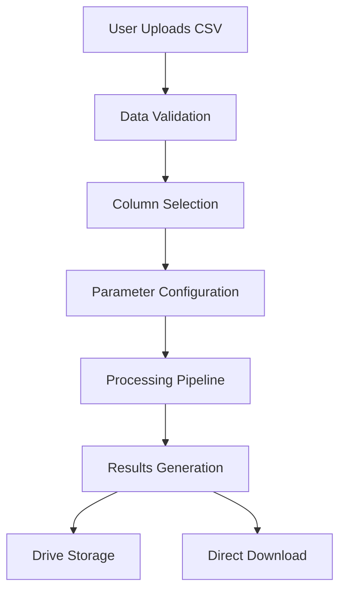

# Tools as Notebooks - Architectural Overview

## Project Overview

**Tools as Notebooks** is a collection of standalone Jupyter notebooks designed to function as specialized text analysis and natural language processing tools. Inspired by [bumatic/colab-notebooks-as-tools](https://github.com/bumatic/colab-notebooks-as-tools/), this project demonstrates the concept of using interactive notebooks as self-contained, user-friendly tools rather than traditional software applications.

### Core Philosophy

The project embodies the principle that complex computational tasks can be made accessible through interactive, self-documenting notebooks that:
- Require no local installation or setup
- Provide clear instructions and guided workflows
- Offer immediate visual feedback and results
- Can be easily shared and reproduced

## Architecture and Design Principles

### Design Patterns

The project follows a consistent architectural pattern across all tools:

```
Install Dependencies → Import Libraries → Mount Storage → 
Load Data → Configure Parameters → Process → Visualize → Export Results
```

### Key Architectural Decisions

1. **Platform Choice**: Google Colab for zero-setup execution
2. **Storage Integration**: Google Drive for seamless file management
3. **User Interface**: Form-based inputs using Colab's `@title` and form features
4. **Modularity**: Each notebook is completely self-contained
5. **Accessibility**: Non-technical users can execute complex NLP tasks

### Code Organization

Each notebook follows a standardized structure:

1. **Header Section**: Purpose, inputs, outputs, and instructions
2. **Setup Cells**: Library installation and imports
3. **Drive Integration**: Google Drive mounting and authentication
4. **Data Loading**: File upload and validation
5. **Configuration**: User parameter input forms
6. **Processing**: Core computational logic
7. **Visualization**: Results display and charts
8. **Export**: Save results to Drive and download

## Individual Tool Architecture

### 1. Lemmatize Documents (`Lemmatize_docs.ipynb`)

**Purpose**: Text preprocessing and lemmatization for English documents

**Technical Stack**:
- `pandas`: Data manipulation
- `spacy`: Natural language processing and lemmatization
- `google.colab`: File handling and Drive integration

**Data Flow**:
```
CSV Input → Text Column Extraction → spaCy NLP Pipeline → 
Lemmatization → Stopword Removal → Cleaned Text Output
```

**Key Features**:
- Batch processing of text documents
- Automatic stopword removal
- English language model utilization
- Preserves original data structure

### 2. Sentiment Analysis (`Sentiment_analysis.ipynb`)

**Purpose**: Dictionary-based sentiment classification of lemmatized text

**Technical Stack**:
- `pandas`: Data processing
- `nltk`: VADER sentiment analyzer
- `google.colab`: File operations

**Data Flow**:
```
Lemmatized Text → VADER Sentiment Analysis → 
Polarity Scoring → Classification (Positive/Negative/Neutral) → 
Sentiment Column Addition
```

**Key Features**:
- Dictionary-based approach for reliability
- Multiple sentiment metrics (compound, positive, negative, neutral)
- Configurable sentiment thresholds
- Custom lexicon support (optional)

### 3. Collocation Analysis (`Plot_collocations_pair.ipynb`)

**Purpose**: Comparative analysis of word collocations for linguistic research

**Technical Stack**:
- `pandas`: Data manipulation
- `nltk`: N-gram generation and text processing
- `matplotlib`/`seaborn`: Visualization
- `numpy`: Statistical calculations

**Data Flow**:
```
Lemmatized Text → N-gram Generation → Collocation Frequency Analysis → 
Log Ratio Calculation → Statistical Comparison → Visualization
```

**Key Features**:
- Bigram collocation analysis
- Comparative frequency visualization
- Log-ratio statistical comparison
- Customizable word pair selection
- Publication-ready plots

### 4. Correspondence Analysis (`Correspondence_analysis.ipynb`)

**Purpose**: Multidimensional analysis of document-term relationships

**Technical Stack**:
- `pandas`/`numpy`: Data processing
- `sklearn`: Document-term matrix creation
- `prince`: Correspondence Analysis implementation
- `matplotlib`/`seaborn`: Visualization
- `adjustText`: Plot label optimization

**Data Flow**:
```
Text Documents → Document-Term Matrix → Correspondence Analysis → 
Dimensionality Reduction → Coordinate Mapping → Interactive Visualization
```

**Key Features**:
- Multi-dimensional relationship mapping
- Document and term coordinate visualization
- Dimensionality reduction for large datasets
- Interactive plot elements
- Relationship strength indicators

## Technical Dependencies

### Core Python Libraries

| Library | Purpose | Used In |
|---------|---------|---------|
| `pandas` | Data manipulation and analysis | All tools |
| `numpy` | Numerical computing | CA, Collocation |
| `matplotlib` | Base plotting functionality | Collocation, CA |
| `seaborn` | Statistical visualization | Collocation, CA |
| `google.colab` | Colab integration and file handling | All tools |

### Specialized NLP Libraries

| Library | Purpose | Used In |
|---------|---------|---------|
| `spacy` | Advanced NLP and lemmatization | Lemmatize |
| `nltk` | General NLP toolkit | Sentiment, Collocation |
| `sklearn` | Machine learning utilities | CA |
| `prince` | Correspondence Analysis | CA |
| `adjustText` | Plot text optimization | CA |

### Infrastructure Dependencies

- **Google Colab**: Execution environment
- **Google Drive**: File storage and sharing
- **Google Account**: Authentication and access control

## Data Flow Architecture

### Input Processing Pipeline



### Inter-Tool Workflow

The tools are designed to work in sequence for comprehensive text analysis:

```
Raw Text → Lemmatize → Sentiment Analysis
                 ↓
         Collocation Analysis
                 ↓
      Correspondence Analysis
```

## Storage and File Management

### Google Drive Integration

- **Auto-mounting**: Seamless Drive access
- **Directory Structure**: `Colab_Data/` for organized storage
- **File Naming**: Timestamp-based unique identifiers
- **Dual Access**: Both Drive storage and direct download

### Data Formats

- **Input**: CSV files with configurable column selection
- **Output**: Enhanced CSV files with additional analysis columns
- **Visualizations**: PNG/PDF format plots
- **Metadata**: JSON configuration files for reproducibility

## User Experience Design

### Accessibility Features

1. **Form-Based Inputs**: No code modification required
2. **Progressive Disclosure**: Collapsible code sections
3. **Clear Instructions**: Step-by-step guidance
4. **Error Handling**: User-friendly error messages
5. **Preview Functionality**: Data validation before processing

### Collaborative Features

- **Sharing**: Direct Colab links for easy distribution
- **Version Control**: Notebook versioning through GitHub
- **Comments**: Inline documentation and explanations
- **Templates**: Consistent structure across tools

## Extension and Customization

### Adding New Tools

To add a new tool to the collection:

1. **Follow Template Structure**: Use existing notebooks as templates
2. **Implement Standard Sections**: Setup, configuration, processing, export
3. **Maintain Consistency**: Use established naming conventions
4. **Add Documentation**: Include purpose, inputs, outputs
5. **Update README**: Add entry to the tools table

### Customization Guidelines

- **Parameter Forms**: Use Colab form features for user inputs
- **Error Handling**: Implement graceful failure modes
- **Output Formats**: Maintain CSV compatibility
- **Visualization**: Follow established styling patterns

## Performance Considerations

### Scalability Limits

- **File Size**: Colab memory limitations (~12GB RAM)
- **Processing Time**: Timeout considerations for large datasets
- **Storage**: Google Drive quota limits

### Optimization Strategies

- **Chunked Processing**: Break large datasets into manageable pieces
- **Memory Management**: Explicit garbage collection
- **Efficient Libraries**: Use optimized implementations (spaCy vs NLTK)
- **Caching**: Store intermediate results when appropriate

## Security and Privacy

### Data Handling

- **Local Processing**: All computation occurs in user's Colab instance
- **No Data Retention**: No persistent storage on external servers
- **User Control**: Complete ownership of data and results
- **Drive Permissions**: User-controlled access to Google Drive

### Best Practices

- **Sensitive Data**: Recommendations for handling confidential information
- **Access Control**: Proper Drive sharing permissions
- **Audit Trail**: Maintaining processing logs
- **Compliance**: GDPR and data protection considerations

## Future Roadmap

### Planned Enhancements

1. **Additional NLP Tools**: Named entity recognition, topic modeling
2. **Advanced Visualizations**: Interactive plots with Plotly
3. **Batch Processing**: Multi-file processing capabilities
4. **Export Options**: Additional format support (Excel, JSON)
5. **Integration**: APIs for programmatic access

### Community Contributions

- **Issue Tracking**: GitHub issues for bug reports and feature requests
- **Pull Requests**: Community-contributed tools and improvements
- **Documentation**: Collaborative documentation improvements
- **Examples**: Sample datasets and use cases

## Conclusion

The Tools as Notebooks architecture successfully demonstrates how complex computational tasks can be made accessible through interactive, self-contained notebooks. By leveraging Google Colab's infrastructure and following consistent design patterns, the project provides a scalable, user-friendly platform for text analysis and natural language processing tasks.

The modular design allows for easy extension and customization while maintaining consistency and usability across all tools. This approach serves as a model for creating accessible computational tools that bridge the gap between complex algorithms and end-user applications.